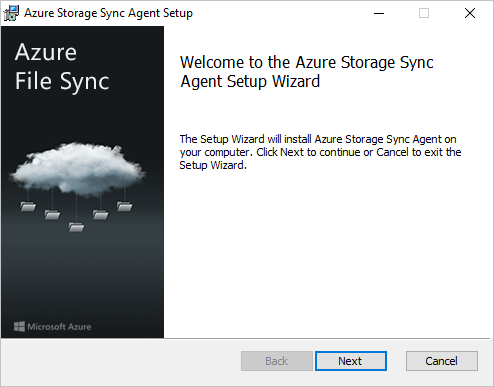
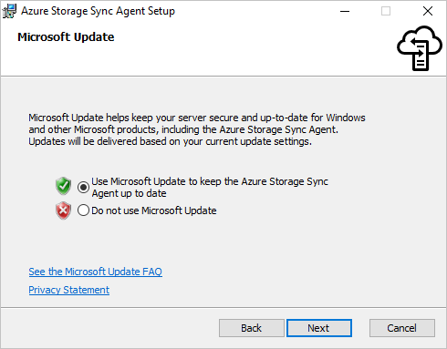
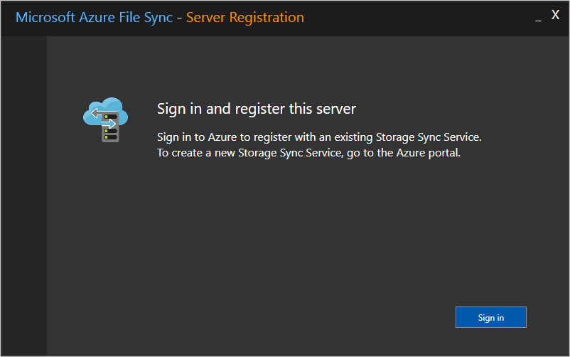
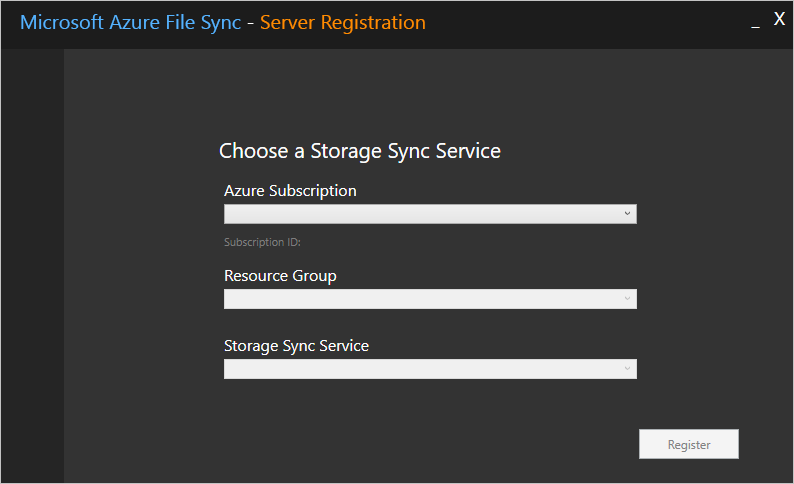
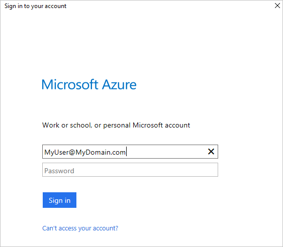
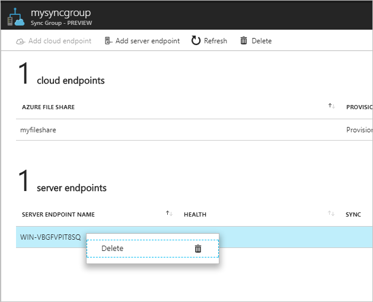
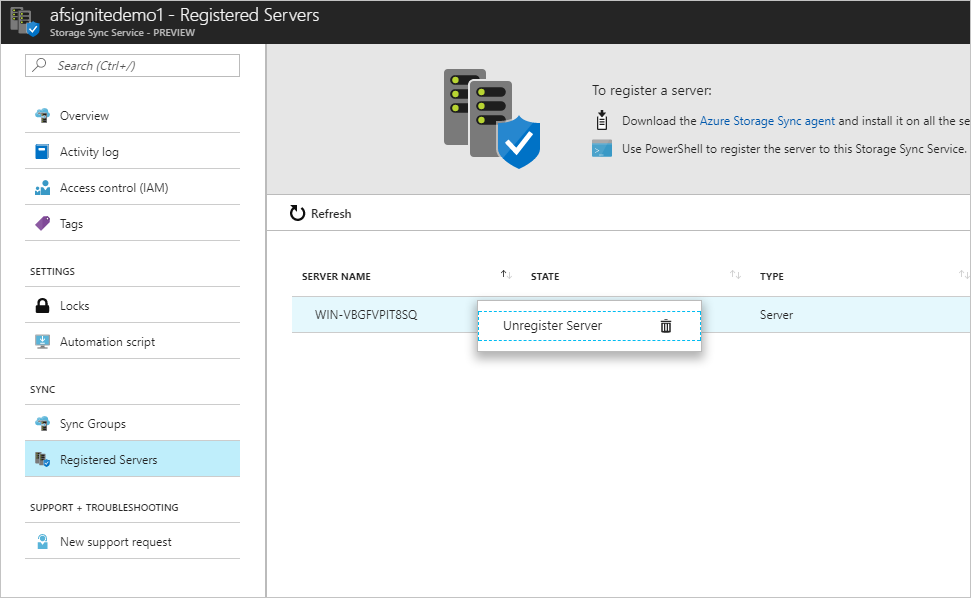

# Register/unregister a server with Azure File Sync (preview)
Azure File Sync (preview) allows you to centralize your organization's file shares in Azure Files without giving up the flexibility, performance, and compatibility of an on-premises file server. It does this by transforming your Windows Servers into a quick cache of your Azure File share. You can use any protocol available on Windows Server to access your data locally (including SMB, NFS, and FTPS) and you can have as many caches as you need across the world.

The following article illustrates how to register and unregister a server with a Storage Sync Service. This may be desired if a server is being decommissioned or if a new Server Endpoint is desired in a Sync Group. See [How to deploy Azure File Sync (preview)](storage-sync-files-deployment-guide.md) for information on how to deploy Azure File Sync end-to-end.

## Prerequisites
To register a Windows Server with a Storage Sync Service, you must first prepare a Windows Server with the necessary prerequisites:

* Ensure that a Storage Sync Service has been deployed. For more information on how to deploy a Storage Sync Service, see [How to deploy Azure File Sync (preview)](storage-sync-files-deployment-guide.md).
* Ensure that the server is connected to the internet and that Azure is accessible.
* Disable the IE Enhanced Security Configuration for administrators with the Server Manager UI.
    
    

* Ensure that the AzureRM PowerShell module is installed on your server. If your server is a member of a Failover Cluster, every node in the cluster will require the AzureRM module. More details on how to install the AzureRM module can be found on the [Install and configure Azure PowerShell](https://docs.microsoft.com/powershell/azure/install-azurerm-ps).

    > [!Note]  
    > We recommend using the newest version of the AzureRM PowerShell module to register/unregister a server. If the AzureRM package has been previously installed on this server (and the PowerShell version on this server is 5.* or greater), you can use the `Update-Module` cmdlet to update this package. 

## Register a server with Storage Sync Service
Before a Windows Server can be used as a *Server Endpoint* in an Azure File Sync *Sync Group*, it must be registered with a *Storage Sync Service*. A server can only be registered with one *Storage Sync Service* at a time.

### Install the Azure File Sync agent
1. [Download the Azure File Sync agent](https://go.microsoft.com/fwlink/?linkid=858257).
2. Start the Azure File Sync agent installer.
    
    

3. Be sure to enable updates to the Azure File Sync agent using Microsoft Update. It is important because critical security fixes and feature enhancements to the server package are shipped via Microsoft Update.

    

4. If the server has not been previously registered, the server registration UI will pop up immediately after completing the installation.

> [!Important]  
> If the server is a member of a Failover Cluster, the Azure File Sync agent needs to be installed on every node in the cluster.

### Register the server using the server registration UI

> [!Important]  
> Cloud Solution Provider subscriptions cannot use the server registration UI. Instead, use PowerShell (below this section).

1. If the server registration UI did not start immediately after completing the installation of the Azure File Sync agent, it can be started manually by executing `C:\Program Files\Azure\StorageSyncAgent\ServerRegistration.exe`.
2. Click *Sign-in* to access your Azure subscription. 

    

3. Pick the correct subscription, resource group, and Storage Sync Service from the dialog.

    

4. In preview, one more sign-in is required to complete the process. 

    

> [!Important]  
> If the server is a member of a Failover Cluster, each server needs to run the Server Registration. When you view the Registered Servers in the Azure Portal, Azure File Sync automatically recognizes each node as a member of the same Failover Cluster, and groups them together appropriately.

### Register the server with PowerShell
You can also perform server registration via PowerShell. This is the only supported way of server registration for Cloud Solution Provider subscriptions:

```PowerShell
Import-Module "C:\Program Files\Azure\StorageSyncAgent\StorageSync.Management.ServerCmdlets.dll"
Login-AzureRmStorageSync -SubscriptionID "<your-subscription-id>" -TenantID "<your-tenant-id>"
Register-AzureRmStorageSyncServer -SubscriptionId "<your-subscription-id>" - ResourceGroupName "<your-resource-group-name>" - StorageSyncService "<your-storage-sync-service-name>"
```

## Unregister the server with Storage Sync Service
There are several steps that are required to unregister a server with a Storage Sync Service. Let's take a look at how to properly unregister a server.

### (Optional) Recall all tiered data
When enabled for a Server Endpoint, cloud tiering will *tier* files to your Azure File shares. This enables on-premises file shares to act as a cache, rather than a complete copy of the dataset, to make efficient use of the space on the file server. However, if a Server Endpoint is removed with tiered files still locally on the server, those files will become unaccessible. Therefore, if continued file access is desired, you must recall all tiered files from Azure Files before continuing with deregistration. 

This can be done with the PowerShell cmdlet as shown below:

```PowerShell
Import-Module "C:\Program Files\Azure\StorageSyncAgent\StorageSync.Management.ServerCmdlets.dll"
Invoke-StorageSyncFileRecall -Path <path-to-to-your-server-endpoint>
```

> [!Warning]  
> If the local volume hosting the Server does not have enough free space to recall all the tiered data, the `Invoke-StorageSyncFileRecall` cmdlet will fail.  

### Remove the server from all Sync Groups
Before unregistering the server on the Storage Sync Service, all Server Endpoints for that server must be removed. This can be done via the Portal:

1. Navigate to the Storage Sync Service where your server is registered.
2. Remove all Server Endpoints for this server in each Sync Group in the Storage Sync Service. This can be accomplished by right-clicking the relevant Server Endpoint in the Sync Group pane.

    

This can also be accomplished with a simple PowerShell script:

```PowerShell
Import-Module "C:\Program Files\Azure\StorageSyncAgent\StorageSync.Management.PowerShell.Cmdlets.dll"

$accountInfo = Login-AzureRmAccount
Login-AzureRmStorageSync -SubscriptionId $accountInfo.Context.Subscription.Id -TenantId $accountInfo.Context.Tenant.Id -ResourceGroupName "<your-resource-group>"

$StorageSyncService = "<your-storage-sync-service>"

Get-AzureRmStorageSyncGroup -StorageSyncServiceName $StorageSyncService | ForEach-Object { 
    $SyncGroup = $_; 
    Get-AzureRmStorageSyncServerEndpoint -StorageSyncServiceName $StorageSyncService -SyncGroupName $SyncGroup.Name | Where-Object { $_.DisplayName -eq $env:ComputerName } | ForEach-Object { 
        Remove-AzureRmStorageSyncServerEndpoint -StorageSyncServiceName $StorageSyncService -SyncGroupName $SyncGroup.Name -ServerEndpointName $_.Name 
    } 
}
```

### Unregister the server
Now that all data has been recalled and the server has been removed from all Sync Groups, the server can be unregistered. 

1. In the Azure portal, navigate the "Registered Servers" section of the Storage Sync Service.
2. Right-click on the server you want to unregister and click "Unregister Server".

    