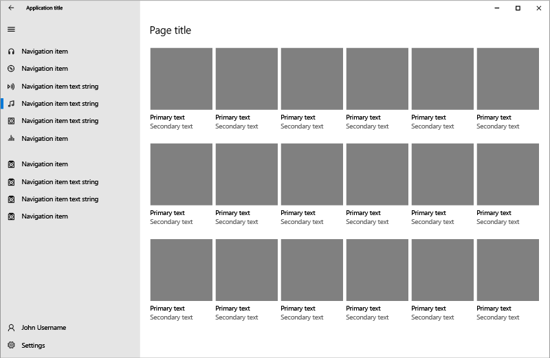
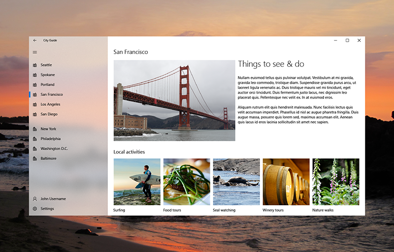
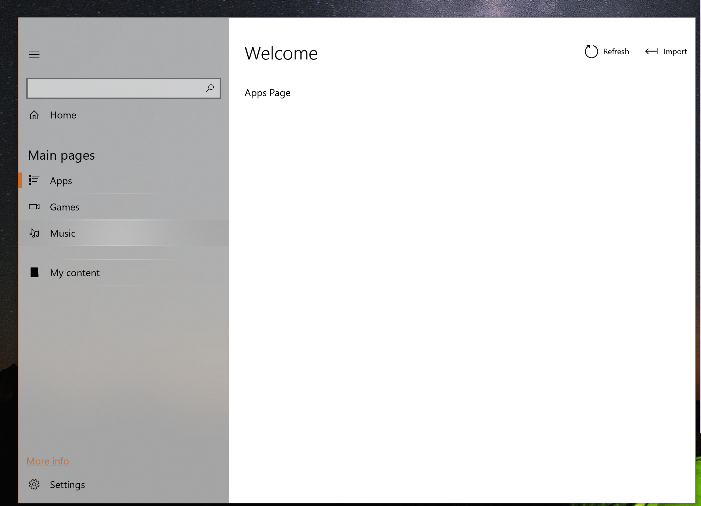

# Navigation view

The navigation view control provides a common vertical layout for top-level areas of your app via a collapsible navigation menu. This control is designed to implement the nav pane, or hamburger menu, pattern and automatically adapts its layout to different window sizes.

> **Important APIs**: [NavigationView class](https://docs.microsoft.com/uwp/api/windows.ui.xaml.controls.navigationview), [NavigationViewItem class](https://docs.microsoft.com/uwp/api/windows.ui.xaml.controls.navigationviewitem), [NavigationViewDisplayMode enumeration](https://docs.microsoft.com/uwp/api/windows.ui.xaml.controls.navigationviewdisplaymode)




## Is this the right control?

NavigationView works well for:

-  Apps with many top-level navigation items that are of similar type. For example, a sports app with categories like Football, Baseball, Basketball, Soccer, and so on.
-  Providing a consistent navigational experience across apps. The pane should include only navigational elements, not actions.
-  A medium-to-high number (5-10) of top-level navigational categories.
-  Preserving screen real estate of smaller windows.

Navigation view is just one of several navigation elements you can use; to learn more about navigation patterns and other navigation elements, see the [Navigation design basics for Universal Windows Platform (UWP) apps](../basics/navigation-basics.md).

Aside from using the NavigationView control, you can build your own nav pane pattern using SplitView and ListView. To see a sample implementation, download the [XAML Navigation solution](https://github.com/Microsoft/Windows-universal-samples/tree/dev/Samples/XamlNavigation) from GitHub.

## Examples

<div style="overflow: hidden; margin: 0 -8px;">
    <div style="float: left; margin: 0 8px 16px; min-width: calc(25% - 16px); max-width: calc(100% - 16px); width: calc((580px - 100%) * 580);">
        <div style="height: 133px; width: 100%">
            </img>
        </div>
    </div>
    <div style="float: left; margin: -22px 8px 16px; min-width: calc(75% - 16px); max-width: calc(100% - 16px); width: calc((580px - 100%) * 580);">
        <p>If you have the <strong style="font-weight: semi-bold">XAML Controls Gallery</strong> app installed, click here to <a href="xamlcontrolsgallery:/item/NavigationView">open the app and see the NavigationView in action</a>.</p>
        <ul>
        <li><a href="https://www.microsoft.com/store/productId/9MSVH128X2ZT">Get the XAML Controls Gallery app (Microsoft Store)</a></li>
        <li><a href="https://github.com/Microsoft/Windows-universal-samples/tree/master/Samples/XamlUIBasics">Get the source code (GitHub)</a></li>
        </ul>
    </div>
</div>

## NavigationView sections
The control is broadly subdivided into three sections - a pane for navigation on the left, and header and content areas on the right.


### Pane

The NavigationView pane can contain:

- Navigation items, in the form of [NavigationViewItem](https://docs.microsoft.com/uwp/api/windows.ui.xaml.controls.navigationviewitem), for navigating to specific pages
- Separators, in the form of [NavigationViewItemSeparator](https://docs.microsoft.com/uwp/api/windows.ui.xaml.controls.navigationviewitemseparator), for grouping navigation items
- Headers, in the form of [NavigationViewItemHeader](https://docs.microsoft.com/uwp/api/windows.ui.xaml.controls.navigationviewitemheader), for labeling groups of items
- An optional [AutoSuggestBox](auto-suggest-box.md) to allow for app-level search
- An optional entry point for [app settings](../app-settings/app-settings-and-data.md). To hide the settings item, use the [IsSettingsVisible](https://docs.microsoft.com/uwp/api/windows.ui.xaml.controls.navigationview#Windows_UI_Xaml_Controls_NavigationView_IsSettingsVisible) property
- Free-form content in the pane’s footer, when added to the [PaneFooter](https://docs.microsoft.com/uwp/api/windows.ui.xaml.controls.navigationview#Windows_UI_Xaml_Controls_NavigationView_PaneFooter) property

The built-in navigation ("hamburger") button lets users open and close the pane. On larger app windows when the pane is open, you may choose to hide this button using the [IsPaneToggleButtonVisible](https://docs.microsoft.com/uwp/api/windows.ui.xaml.controls.navigationview#Windows_UI_Xaml_Controls_NavigationView_IsPaneToggleButtonVisible) property.

#### Visual style

NavigationView items have support for selected, disabled, pointer over, pressed, and focused visual states.


When hardware and software requirements are met, NavigationView automatically uses the new [Acrylic material](../style/acrylic.md) and [Reveal highlight](../style/reveal.md) in its pane.

### Header

The header area is vertically aligned with the navigation button and has a fixed height of 52 px. Its purpose is to hold the page title of the selected nav category. The header is docked to the top of the page and acts as a scroll clipping point for the content area.

The header must be visible when NavigationView is in Minimal mode. You may choose to hide the header in other modes, which are used on larger window widths. To do so, set the [AlwaysShowHeader](https://docs.microsoft.com/uwp/api/windows.ui.xaml.controls.navigationview#Windows_UI_Xaml_Controls_NavigationView_AlwaysShowHeader) property to **false**.

### Content

The content area is where most of the information for the selected nav category is displayed. It can contain one or more elements and is a good area for additional sub-level navigation such as [Pivot](tabs-pivot.md).

We recommend 12px margins on your content’s sides when NavigationView is in Minimal mode and 24px margins otherwise.

## NavigationView modes
The NavigationView pane can be open or closed, and has three display mode options:
-  **Minimal**
   Only the hamburger button remains fixed while the pane shows and hides as needed.
-  **Compact**
   The pane always shows as a narrow sliver which can be opened to full width.
-  **Expanded**
   The pane is open alongside the content. When closed by activating the hamburger button, the pane's width becomes a narrow sliver.

By default, the system automatically selects the optimal display mode based on the amount of screen space available to the control. (You can override this setting — see the next section for details.)

### Minimal


-  When closed, the pane is hidden by default, with only the nav button visible.
-  Provides on-demand navigation that conserves screen real estate. Ideal for apps on phones and phablets.
-  Pressing the nav button opens and closes the pane, which draws as an overlay above the header and content. Content does not reflow.
-  When open, the pane is transient and can be closed with a light dismiss gesture such as making a selection, pressing the back button, or tapping outside the pane.
-  The selected item becomes visible when the pane’s overlay opens.
-  When requirements are met, the open pane’s background is [in-app acrylic](../style/acrylic.md#acrylic-blend-types).
-  By default, NavigationView is in Minimal mode when its overall width is less than or equal to 640px.

### Compact


-  When closed, a vertical sliver of the pane showing only icons and the nav button is visible.
-  Provides some indication of the selected location while using a small amount of screen real estate.
-  This mode is better suited for medium screens like tablets and [10-foot experiences](../devices/designing-for-tv.md).
-  Pressing the nav button opens and closes the pane, which draws as an overlay above the header and content. Content does not reflow.
-  The Header is not required and can be hidden to give Content more vertical space.
-  The selected item shows a visual indicator to highlight where the user is in the navigation tree.
-  When requirements are met, the pane’s background is [in-app acrylic](../style/acrylic.md#acrylic-blend-types).
-  By default, NavigationView is in Compact mode when its overall width is between 641px and 1007px.

### Expanded



-  By default, the pane remains open. This mode is better suited for larger screens.
-  The pane draws side-by-side with the header and content, which reflows within its available space.
-  When the pane is closed using the nav button, the pane shows as a narrow sliver side-by-side with the header and content.
-  The Header is not required and can be hidden to give Content more vertical space.
-  The selected item shows a visual indicator to highlight where the user is in the navigation tree.
-  When requirements are met, the pane’s background is painted using [background acrylic](../style/acrylic.md#acrylic-blend-types).
-  By default, NavigationView is in Expanded mode when its overall width is greater than 1007px.

## Overriding the default adaptive behavior

NavigationView automatically changes its display mode based on the amount of screen space available to it.

> [!NOTE] 
NavigationView should serve as the root container of your app, this control is designed to span the full width and height of the app window.
You can override the widths at which the navigation view changes display modes by using the [CompactModeThresholdWidth](https://docs.microsoft.com/uwp/api/windows.ui.xaml.controls.navigationview#Windows_UI_Xaml_Controls_NavigationView_CompactModeThresholdWidth) and [ExpandedModeThresholdWidth](https://docs.microsoft.com/uwp/api/windows.ui.xaml.controls.navigationview#Windows_UI_Xaml_Controls_NavigationView_ExpandedModeThresholdWidth) properties. 

Consider the following scenarios that illustrate when you might want to customize the display mode behavior.

- **Frequent navigation** If you expect users to navigate between app areas somewhat frequently, consider keeping the pane in view at narrower window widths. A music app with Songs / Albums / Artists navigation areas may opt for a 280px pane width and remain in Expanded mode while the app window is wider than 560px.
```xaml
<NavigationView OpenPaneLength="280" CompactModeThresholdWidth="560" ExpandedModeThresholdWidth="560"/>
```

- **Rare navigation** If you expect users to navigate between app areas very infrequently, consider keeping the pane hidden at wider window widths. A calculator app with multiple layouts may opt to remain in Minimal mode even when the app is maximized on a 1080p display.
```xaml
<NavigationView CompactModeThresholdWidth="1920" ExpandedModeThresholdWidth="1920"/>
```

- **Icon disambiguation** If your app’s navigation areas don’t lend themselves to meaningful icons, avoid using Compact mode. An image viewing app with Collections / Albums / Folders navigation areas may opt for showing NavigationView in Minimal mode at narrow and medium widths, and in Expanded mode at wide width.
```xaml
<NavigationView CompactModeThresholdWidth="1008"/>
```

## Interaction

When users tap on a navigation item in the Pane, NavigationView will show that item as selected and will raise an [ItemInvoked](https://docs.microsoft.com/uwp/api/windows.ui.xaml.controls.navigationview#Windows_UI_Xaml_Controls_NavigationView_ItemInvoked) event. If the tap results in a new item being selected, NavigationView will also raise a [SelectionChanged](https://docs.microsoft.com/uwp/api/windows.ui.xaml.controls.navigationview#Windows_UI_Xaml_Controls_NavigationView_SelectionChanged) event. 

Your app is responsible for updating the Header and Content with appropriate information in response to this user interaction. In addition, we recommend programmatically moving [focus](https://docs.microsoft.com/en-us/uwp/api/windows.ui.xaml.controls.control#Windows_UI_Xaml_Controls_Control_Focus_Windows_UI_Xaml_FocusState_) from the navigation item to the content. By setting initial focus on load, you streamline the user flow and minimize the expected number of keyboard focus moves.


## Backwards navigation

NavigationView does not automatically show the back button in your app’s title bar nor add content to the back stack. The control does not automatically respond to software or hardware back button presses. Please see the [history and backwards navigation](../basics/navigation-history-and-backwards-navigation.md) section for more information about this topic and how to add support for navigation to your app.


## Code example

The following is a simple example of how you can incorporate NavigationView into your app.



```xaml
<Page
    x:Class="NavigationViewSample.MainPage"
    xmlns="http://schemas.microsoft.com/winfx/2006/xaml/presentation"
    xmlns:x="http://schemas.microsoft.com/winfx/2006/xaml"
    xmlns:local="using:NavigationViewSample"
    xmlns:d="http://schemas.microsoft.com/expression/blend/2008"
    xmlns:mc="http://schemas.openxmlformats.org/markup-compatibility/2006"
    mc:Ignorable="d">

    <NavigationView x:Name="NavView"
                    ItemInvoked="NavView_ItemInvoked"
                    SelectionChanged="NavView_SelectionChanged"
                    Loaded="NavView_Loaded">

        <NavigationView.MenuItems>
            <NavigationViewItem Content="Home" Tag="home">
                <NavigationViewItem.Icon>
                    <FontIcon Glyph="&#xE10F;"/>
                </NavigationViewItem.Icon>
            </NavigationViewItem>
            <NavigationViewItemSeparator/>
            <NavigationViewItemHeader Content="Main pages"/>
            <NavigationViewItem Icon="AllApps" Content="Apps" Tag="apps"/>
            <NavigationViewItem Icon="Video" Content="Games" Tag="games"/>
            <NavigationViewItem Icon="Audio" Content="Music" Tag="music"/>
        </NavigationView.MenuItems>

        <NavigationView.AutoSuggestBox>
            <AutoSuggestBox x:Name="ASB" QueryIcon="Find"/>
        </NavigationView.AutoSuggestBox>

        <NavigationView.HeaderTemplate>
            <DataTemplate>
                <Grid Margin="24,24,0,0">
                    <Grid.ColumnDefinitions>
                        <ColumnDefinition Width="Auto"/>
                        <ColumnDefinition/>
                    </Grid.ColumnDefinitions>
                    <TextBlock Style="{StaticResource TitleTextBlockStyle}"
                           FontSize="28"
                           VerticalAlignment="Center"
                           Text="Welcome"/>
                    <CommandBar Grid.Column="1"
                            HorizontalAlignment="Right"
                            VerticalAlignment="Center"
                            DefaultLabelPosition="Right"
                            Background="{ThemeResource SystemControlBackgroundAltHighBrush}">
                        <AppBarButton Label="Refresh" Icon="Refresh"/>
                        <AppBarButton Label="Import" Icon="Import"/>
                    </CommandBar>
                </Grid>
            </DataTemplate>
        </NavigationView.HeaderTemplate>

        <NavigationView.PaneFooter>
            <HyperlinkButton x:Name="MoreInfoBtn"
                             Content="More info"
                             Click="More_Click"
                             Margin="12,0"/>
        </NavigationView.PaneFooter>

        <Frame x:Name="ContentFrame" Margin="24">
            <Frame.ContentTransitions>
                <TransitionCollection>
                    <NavigationThemeTransition/>
                </TransitionCollection>
            </Frame.ContentTransitions>
        </Frame>

    </NavigationView>
</Page>
```

```csharp
private void NavView_Loaded(object sender, RoutedEventArgs e)
{
    // you can also add items in code behind
    NavView.MenuItems.Add(new NavigationViewItemSeparator()); 
    NavView.MenuItems.Add(new NavigationViewItem()
        { Content = "My content", Icon = new SymbolIcon(Symbol.Folder), Tag = "content" });

    // set the initial SelectedItem 
    foreach (NavigationViewItemBase item in NavView.MenuItems)
    {
        if (item is NavigationViewItem && item.Tag.ToString() == "apps")
        {
            NavView.SelectedItem = item;
            break;
        }
    }
}

private void NavView_ItemInvoked(NavigationView sender, NavigationViewItemInvokedEventArgs args)
{
    if (args.IsSettingsInvoked)
    {
        ContentFrame.Navigate(typeof(SettingsPage));
    }
    else
    {
        switch (args.InvokedItem)
        {
          case "Home":
              ContentFrame.Navigate(typeof(HomePage));
              break;

          case "Apps":
              ContentFrame.Navigate(typeof(AppsPage));
              break;

          case "Games":
              ContentFrame.Navigate(typeof(GamesPage));
              break;

          case "Music":
              ContentFrame.Navigate(typeof(MusicPage));
              break;

          case "My content":
              ContentFrame.Navigate(typeof(MyContentPage));
              break;
        }
    }
}

private void NavView_SelectionChanged(NavigationView sender, NavigationViewSelectionChangedEventArgs args)
{
    if (args.IsSettingsSelected)
    {
        ContentFrame.Navigate(typeof(SettingsPage));
    }
    else
    {

        NavigationViewItem item = args.SelectedItem as NavigationViewItem;

        switch (item.Tag)
        {
          case "home":
              ContentFrame.Navigate(typeof(HomePage));
              break;

            case "apps":
                ContentFrame.Navigate(typeof(AppsPage));
                break;

            case "games":
                ContentFrame.Navigate(typeof(GamesPage));
                break;

            case "music":
                ContentFrame.Navigate(typeof(MusicPage));
                break;

            case "content":
                ContentFrame.Navigate(typeof(MyContentPage));
                break;
        }
    }
}
```

## Customizing backgrounds

To change the background of NavigationView's main area, set its `Background` property to your preferred brush.

The Pane's background shows in-app acrylic when NavigationView is in Minimal or Compact mode, and background acrylic in Expanded mode. To update this behavior or customize the appearance of your Pane's acrylic, modify the two theme resources by overwriting them in your App.xaml.

```xaml
<AcrylicBrush x:Key="NavigationViewDefaultPaneBackground"
              BackgroundSource="Backdrop" TintColor="Yellow" TintOpacity=".6"/>
<AcrylicBrush x:Key="NavigationViewExpandedPaneBackground"
              BackgroundSource="HostBackdrop" TintColor="Orange" TintOpacity=".8"/>
```

## Extending your app into the title bar

For a seamless, flowing look within your app's window, we recommend extending NavigationView and its acrylic pane up into your app's title bar area. This avoids the visually unattractive shape created by the title bar, the solid-colored NavigationView Content, and the acrylic of NavigationView's pane.

To do so, add the following code to your App.xaml.cs.

```csharp
//draw into the title bar
CoreApplication.GetCurrentView().TitleBar.ExtendViewIntoTitleBar = true;

//remove the solid-colored backgrounds behind the caption controls and system back button
ApplicationViewTitleBar titleBar = ApplicationView.GetForCurrentView().TitleBar;
titleBar.ButtonBackgroundColor = Colors.Transparent;
titleBar.ButtonInactiveBackgroundColor = Colors.Transparent;
```

Drawing into the title bar has the side-effect of hiding your app's title. To help users, restore the title by adding your own TextBlock. Add the following markup to the root page containing your NavigationView.

```xaml
<!-- Page attribute -->
xmlns:appmodel="using:Windows.ApplicationModel"

<TextBlock x:Name="AppTitle" Style="{StaticResource CaptionTextBlockStyle}" Text="{x:Bind appmodel:Package.Current.DisplayName}" IsHitTestVisible="False"/>
```

You'll also need to adjust AppTitle's margins depending on back button's visibility.

```csharp
CoreApplicationViewTitleBar titleBar = CoreApplication.GetCurrentView().TitleBar;
titleBar.LayoutMetricsChanged += TitleBar_LayoutMetricsChanged;

private void TitleBar_LayoutMetricsChanged(CoreApplicationViewTitleBar sender, object args)
{
    AppTitle.Margin = new Thickness(CoreApplication.GetCurrentView().TitleBar.SystemOverlayLeftInset + 12, 8, 0, 0);
}
```

For more information about customizing title bars, see [title bar customization](../shell/title-bar.md).

## Get the sample code

- [XAML Controls Gallery sample](https://github.com/Microsoft/Windows-universal-samples/tree/master/Samples/XamlUIBasics) - See all the XAML controls in an interactive format.

## Related topics

- [NavigationView class](https://docs.microsoft.com/uwp/api/windows.ui.xaml.controls.navigationview)
- [Master/details](master-details.md)
- [Pivot control](tabs-pivot.md)
- [Navigation basics](../basics/navigation-basics.md)
- [Fluent Design for UWP overview](../fluent-design-system/index.md)