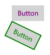
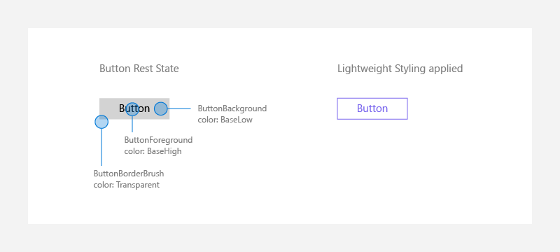

# XAML styles


You can customize the appearance of your apps in many ways by using the XAML framework. Styles let you set control properties and reuse those settings for a consistent appearance across multiple controls.

## Style basics

Use styles to extract visual property settings into reusable resources. Here's an example that shows 3 buttons with a style that sets the [BorderBrush](https://msdn.microsoft.com/library/windows/apps/br209397), [BorderThickness](https://msdn.microsoft.com/library/windows/apps/br209399) and [Foreground](https://msdn.microsoft.com/library/windows/apps/br209414) properties. By applying a style, you can make the controls appear the same without having to set these properties on each control separately.


You can define a style inline in the XAML for a control, or as a reusable resource. Define resources in an individual page's XAML file, in the App.xaml file, or in a separate resource dictionary XAML file. A resource dictionary XAML file can be shared across apps, and more than one resource dictionary can be merged in a single app. Where the resource is defined determines the scope in which it can be used. Page-level resources are available only in the page where they are defined. If resources with the same key are defined in both App.xaml and in a page, the resource in the page overrides the resource in App.xaml. If a resource is defined in a separate resource dictionary file, it's scope is determined by where the resource dictionary is referenced.

In the [Style](https://msdn.microsoft.com/library/windows/apps/br208849) definition, you need a [TargetType](https://msdn.microsoft.com/library/windows/apps/br208857) attribute and a collection of one or more [Setter](https://msdn.microsoft.com/library/windows/apps/br208817) elements. The **TargetType** attribute is a string that specifies a [FrameworkElement](https://msdn.microsoft.com/library/windows/apps/br208706) type to apply the style to. The **TargetType** value must specify a **FrameworkElement**-derived type that's defined by the Windows Runtime or a custom type that's available in a referenced assembly. If you try to apply a style to a control and the control's type doesn't match the **TargetType** attribute of the style you're trying to apply, an exception occurs.

Each [Setter](https://msdn.microsoft.com/library/windows/apps/br208817) element requires a [Property](https://msdn.microsoft.com/library/windows/apps/br208836) and a [Value](https://msdn.microsoft.com/library/windows/apps/br208838). These property settings indicate what control property the setting applies to, and the value to set for that property. You can set the **Setter.Value** with either attribute or property element syntax. The XAML here shows the style applied to the buttons shown previously. In this XAML, the first two **Setter** elements use attribute syntax, but the last **Setter**, for the [BorderBrush](https://msdn.microsoft.com/library/windows/apps/br209397) property, uses property element syntax. The example doesn't use the [x:Key attribute](../../xaml-platform/x-key-attribute.md) attribute, so the style is implicitly applied to the buttons. Applying styles implicitly or explicitly is explained in the next section.

```XAML
<Page.Resources>
    <Style TargetType="Button">
        <Setter Property="BorderThickness" Value="5" />
        <Setter Property="Foreground" Value="Black" />
        <Setter Property="BorderBrush" >
            <Setter.Value>
                <LinearGradientBrush StartPoint="0.5,0" EndPoint="0.5,1">
                    <GradientStop Color="Yellow" Offset="0.0" />
                    <GradientStop Color="Red" Offset="0.25" />
                    <GradientStop Color="Blue" Offset="0.75" />
                    <GradientStop Color="LimeGreen" Offset="1.0" />
                </LinearGradientBrush>
            </Setter.Value>
        </Setter>
    </Style>
</Page.Resources>

<StackPanel Orientation="Horizontal">
    <Button Content="Button"/>
    <Button Content="Button"/>
    <Button Content="Button"/>
</StackPanel>
```

## Apply an implicit or explicit style

If you define a style as a resource, there are two ways to apply it to your controls:

-   Implicitly, by specifying only a [TargetType](https://msdn.microsoft.com/library/windows/apps/br208857) for the [Style](https://msdn.microsoft.com/library/windows/apps/br208849).
-   Explicitly, by specifying a [TargetType](https://msdn.microsoft.com/library/windows/apps/br208857) and an [x:Key attribute](../../xaml-platform/x-key-attribute.md) attribute for the [Style](https://msdn.microsoft.com/library/windows/apps/br208849) and then by setting the target control's [Style](https://msdn.microsoft.com/library/windows/apps/br208743) property with a [{StaticResource} markup extension](https://msdn.microsoft.com/library/windows/apps/mt185588) reference that uses the explicit key.

If a style contains the [x:Key attribute](../../xaml-platform/x-key-attribute.md), you can only apply it to a control by setting the [Style](https://msdn.microsoft.com/library/windows/apps/br208743) property of the control to the keyed style. In contrast, a style without an x:Key attribute is automatically applied to every control of its target type, that doesn't otherwise have an explicit style setting.

Here are two buttons that demonstrate implicit and explicit styles.



In this example, the first style has an [x:Key attribute](../../xaml-platform/x-key-attribute.md) and its target type is [Button](https://msdn.microsoft.com/library/windows/apps/br209265). The first button's [Style](https://msdn.microsoft.com/library/windows/apps/br208743) property is set to this key, so this style is applied explicitly. The second style is applied implicitly to the second button because its target type is **Button** and the style doesn't have an x:Key attribute.

```XAML
<Page.Resources>
    <Style x:Key="PurpleStyle" TargetType="Button">
        <Setter Property="FontFamily" Value="Segoe UI"/>
        <Setter Property="FontSize" Value="14"/>
        <Setter Property="Foreground" Value="Purple"/>
    </Style>

    <Style TargetType="Button">
        <Setter Property="FontFamily" Value="Segoe UI"/>
        <Setter Property="FontSize" Value="14"/>
        <Setter Property="RenderTransform">
            <Setter.Value>
                <RotateTransform Angle="25"/>
            </Setter.Value>
        </Setter>
        <Setter Property="BorderBrush" Value="Green"/>
        <Setter Property="BorderThickness" Value="2"/>
        <Setter Property="Foreground" Value="Green"/>
    </Style>
</Page.Resources>

<Grid x:Name="LayoutRoot">
    <Button Content="Button" Style="{StaticResource PurpleStyle}"/>
    <Button Content="Button"/>
</Grid>
```

## Use based-on styles

To make styles easier to maintain and to optimize style reuse, you can create styles that inherit from other styles. You use the [BasedOn](https://msdn.microsoft.com/library/windows/apps/br208852) property to create inherited styles. Styles that inherit from other styles must target the same type of control or a control that derives from the type targeted by the base style. For example, if a base style targets [ContentControl](https://msdn.microsoft.com/library/windows/apps/br209365), styles that are based on this style can target **ContentControl** or types that derive from **ContentControl** such as [Button](https://msdn.microsoft.com/library/windows/apps/br209265) and [ScrollViewer](https://msdn.microsoft.com/library/windows/apps/br209527). If a value is not set in the based-on style, it's inherited from the base style. To change a value from the base style, the based-on style overrides that value. The next example shows a **Button** and a [CheckBox](https://msdn.microsoft.com/library/windows/apps/br209316) with styles that inherit from the same base style.


The base style targets [ContentControl](https://msdn.microsoft.com/library/windows/apps/br209365), and sets the [Height](/uwp/api/Windows.UI.Xaml.FrameworkElement#Windows_UI_Xaml_FrameworkElement_Height), and [Width](/uwp/api/Windows.UI.Xaml.FrameworkElement#Windows_UI_Xaml_FrameworkElement_Width) properties. The styles based on this style target [CheckBox](https://msdn.microsoft.com/library/windows/apps/br209316) and [Button](https://msdn.microsoft.com/library/windows/apps/br209265), which derive from **ContentControl**. The based-on styles set different colors for the [BorderBrush](https://msdn.microsoft.com/library/windows/apps/br209397) and [Foreground](https://msdn.microsoft.com/library/windows/apps/br209414) properties. (You don't typically put a border around a **CheckBox**. We do it here to show the effects of the style.)

```XAML
<Page.Resources>
    <Style x:Key="BasicStyle" TargetType="ContentControl">
        <Setter Property="Width" Value="130" />
        <Setter Property="Height" Value="30" />
    </Style>

    <Style x:Key="ButtonStyle" TargetType="Button"
           BasedOn="{StaticResource BasicStyle}">
        <Setter Property="BorderBrush" Value="Orange" />
        <Setter Property="BorderThickness" Value="2" />
        <Setter Property="Foreground" Value="Red" />
    </Style>

    <Style x:Key="CheckBoxStyle" TargetType="CheckBox"
           BasedOn="{StaticResource BasicStyle}">
        <Setter Property="BorderBrush" Value="Blue" />
        <Setter Property="BorderThickness" Value="2" />
        <Setter Property="Foreground" Value="Green" />
    </Style>
</Page.Resources>

<StackPanel>
    <Button Content="Button" Style="{StaticResource ButtonStyle}" Margin="0,10"/>
    <CheckBox Content="CheckBox" Style="{StaticResource CheckBoxStyle}"/>
</StackPanel>
```

## Use tools to work with styles easily

A fast way to apply styles to your controls is to right-click on a control on the Microsoft Visual Studio XAML design surface and select **Edit Style** or **Edit Template** (depending on the control you are right-clicking on). You can then apply an existing style by selecting **Apply Resource** or define a new style by selecting **Create Empty**. If you create an empty style, you are given the option to define it in the page, in the App.xaml file, or in a separate resource dictionary.

## Lightweight styling

Overriding the system brushes is generally done at the App or Page level, and in either case the color override will affect all controls that reference that brush – and in XAML many controls can reference the same system brush.



```XAML
<Page.Resources>
    <ResourceDictionary>
        <ResourceDictionary.ThemeDictionaries>
            <ResourceDictionary x:Key="Light">
                 <SolidColorBrush x:Key="ButtonBackground" Color="Transparent"/>
                 <SolidColorBrush x:Key="ButtonForeground" Color="MediumSlateBlue"/>
                 <SolidColorBrush x:Key="ButtonBorderBrush" Color="MediumSlateBlue"/>
            </ResourceDictionary>
        </ResourceDictionary.ThemeDictionaries>
    </ResourceDictionary>
</Page.Resources>
```

For states like PointerOver (mouse is hovered over the button), **PointerPressed** (button has been invoked), or Disabled (button is not interactable). These endings are appended onto the original Lightweight styling names: **ButtonBackgroundPointerOver**, **ButtonForegroundPointerPressed**, **ButtonBorderBrushDisabled**, etc. Modifying those brushes as well, will make sure that your controls are colored consistently to your app's theme.

Placing these brush overrides at the **App.Resources** level, will alter all the buttons within the entire app, instead of on a single page.

### Per-control styling

In other cases, changing a single control on one page only to look a certain way, without altering any other versions of that control, is desired:


```XAML
<CheckBox Content="Normal CheckBox" Margin="5"/>
    <CheckBox Content="Special CheckBox" Margin="5">
        <CheckBox.Resources>
            <ResourceDictionary>
                <ResourceDictionary.ThemeDictionaries>
                    <ResourceDictionary x:Key="Light">
                        <SolidColorBrush x:Key="CheckBoxForegroundUnchecked"
                            Color="Purple"/>
                        <SolidColorBrush x:Key="CheckBoxForegroundChecked"
                            Color="Purple"/>
                        <SolidColorBrush x:Key="CheckBoxCheckGlyphForegroundChecked"
                            Color="White"/>
                        <SolidColorBrush x:Key="CheckBoxCheckBackgroundStrokeChecked"  
                            Color="Purple"/>
                        <SolidColorBrush x:Key="CheckBoxCheckBackgroundFillChecked"
                            Color="Purple"/>
                    </ResourceDictionary>
                </ResourceDictionary.ThemeDictionaries>
            </ResourceDictionary>
        </CheckBox.Resources>
    </CheckBox>
<CheckBox Content="Normal CheckBox" Margin="5"/>
```

This would only effect that one “Special CheckBox” on the page where that control existed.

## Modify the default system styles

You should use the styles that come from the Windows Runtime default XAML resources when you can. When you have to define your own styles, try to base your styles on the default ones when possible (using based-on styles as explained earlier, or start by editing a copy of the original default style).

## The template property

A style setter can be used for the [Template](https://msdn.microsoft.com/library/windows/apps/br209465) property of a [Control](https://msdn.microsoft.com/library/windows/apps/br209390), and in fact this makes up the majority of a typical XAML style and an app's XAML resources. This is discussed in more detail in the topic [Control templates](control-templates.md).
