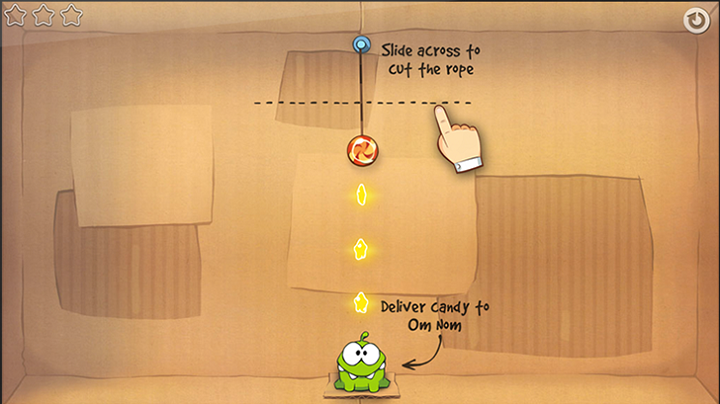
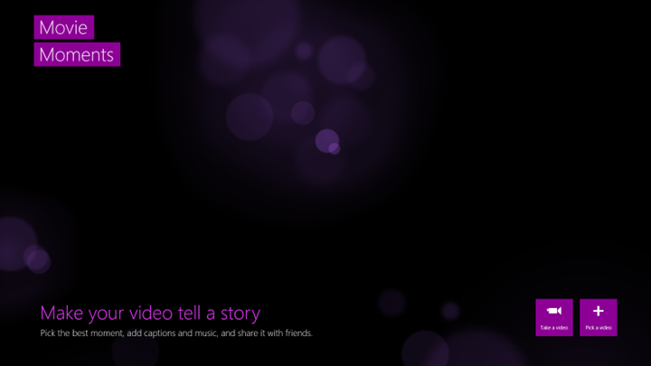
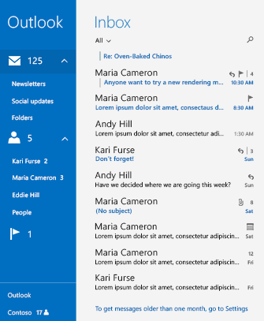
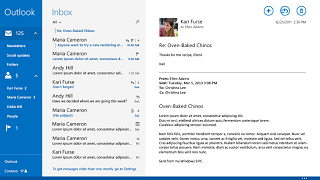
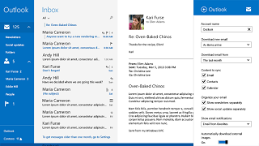

# Instructional UI guidelines

In some circumstances it can be helpful to teach the user about functions in your app that might not be obvious to them, such as specific touch interactions. In these cases, you need to present instructions to the user through the user interface (UI), so that they can use those features they might have missed.

## When to use instructional UI

Instructional UI has to be used carefully. When overused, it can be easily ignored or annoy the user, causing it to be ineffective.

Instructional UI should be used to help the user discover important and non-obvious features of your app, such as touch gestures or settings they may be interested in. It can also be used to inform users about new features or changes in your app that they might have otherwise overlooked.

Unless your app is dependent on touch gestures, instructional UI should not be used to teach users the fundamental features of your app.

## Principles of writing instructional UI

Good instructional UI is relevant and educational to the user, and enhances the user experience. It should be:

-   **Simple:** Users don't want their experience to be interrupted with complicated information
-   **Memorable:** Users don't want to see the same instructions every time they attempt a task, so instructions need to be something they'll remember.
-   **Immediately relevant:** If the instructional UI doesn't teach a user about something that they immediately want to do, they won't have a reason to pay attention to it.

Avoid overusing instructional UI, and be sure to choose the right topics. Do not teach:

-   **Fundamental features:** If a user needs instructions to use your app, consider making the app design more intuitive.
-   **Obvious features:** If a user can figure out a feature on their own without instruction, then the instructional UI will just get in the way.
-   **Complex features:** Instructional UI needs to be concise, and users interested in complex features are usually willing to seek out instructions and don't need to be given them.

Avoid inconveniencing the user with your instructional UI. Do not:

-   **Obscure important information:** Instructional UI should never get in the way of other features of your app.
-   **Force users to participate:** Users should be able to ignore instructional UI and still progress through the app.
-   **Displaying repeat information:** Don't harass the user with instructional UI, even if they ignore it the first time. Adding an setting to display instructional UI again is a better solution.

## Examples of instructional UI

Here are a few instances in which instructional UI can help your users learn:

-   **Helping users discover touch interactions.** The following screen shot shows instructional UI teaching a player how to use touch gestures in the game, Cut the Rope.

    

-   **Making a great first impression.** When Movie Moments launches for the first time, instructional UI prompts the user to begin creating movies without obstructing their experience.

    

-   **Guiding users to take the next step in a complicated task.** In the Windows Mail app, a hint at the bottom of the Inbox directs users to **Settings** to access older messages.

    

    When the user clicks the message, the app's **Settings** flyout appears on the right side of the screen, allowing the user to complete the task. These screen shots show the Mail app before and after a user clicks the instructional UI message.

    | Before                                                               | After                                                                                                        |
    |----------------------------------------------------------------------|--------------------------------------------------------------------------------------------------------------|
    |  |  |

## Related articles

* [Guidelines for app help](guidelines-for-app-help.md)
