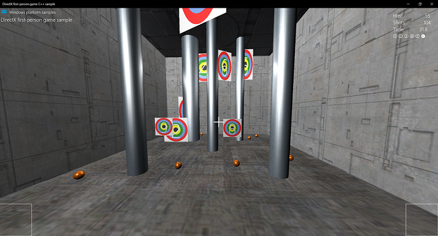

# Create a simple Universal Windows Platform (UWP) game with DirectX

In this set of tutorials, you learn how to create a basic Universal Windows Platform (UWP) game with DirectX and C++. We cover all the major parts of a game, including the processes for loading assets such as arts and meshes, creating a main game loop, implementing a simple rendering pipeline, and adding sound and controls.

We show you the UWP game development techniques and considerations. We don't provide a complete end-to-end game. Rather, we focus on key UWP DirectX game development concepts, and call out Windows Runtime specific considerations around those concepts.

## Objective

To use the basic concepts and components of a UWP DirectX game, and to become more comfortable designing UWP games with DirectX.

## What you need to know before starting

Before we get started with this tutorial, you need to be familiar with these subjects.

-   Microsoft C++ with Windows Runtime Language Extensions (C++/CX). This is an update to Microsoft C++ that incorporates automatic reference counting, and is the language for developing a UWP games with DirectX 11.1 or later versions.
-   Basic linear algebra and Newtonian physics concepts.
-   Basic graphics programming terminology.
-   Basic Windows programming concepts.
-   Basic familiarity with the [Direct2D](https://msdn.microsoft.com/library/windows/apps/dd370990.aspx) and [Direct3D 11](https://msdn.microsoft.com/library/windows/desktop/hh404569) APIs.

##  The Windows Store Direct3D shooting game sample

This sample implements a simple first-person shooting gallery, where the player fires balls at moving targets. Hitting each target awards a set number of points, and the player can progress through 6 levels of increasing challenge. At the end of the levels, the points are tallied, and the player is awarded a final score.

The sample demonstrates the game concepts:

-   Interoperation between DirectX 11.1 and the Windows Runtime
-   A first-person 3D perspective and camera
-   Stereoscopic 3D effects
-   Collision detection between objects in 3D
-   Handling player input for mouse, touch, and Xbox controller controls
-   Audio mixing and playback
-   A basic game state machine

| Topic | Description |
|---------------------------------------------------------------------------------------------------|----------------------------------------------------------------------------------------------------------------------------------------------------------------------------------------------------------------------------------------------------------------------------------------------------------------------------------------------------------------------------------------------------------------------------------------------------------------|
| [Set up the game project](tutorial--setting-up-the-games-infrastructure.md) | The first step in assembling your game is to set up a project in Microsoft Visual Studio in such a way that you minimize the amount of code infrastructure work you need to do. You can save yourself a lot of time and hassle by using the right template and configuring the project specifically for game development. We walk you through the setup and configuration of a simple game project. |
| [Define the game's UWP app framework](tutorial--building-the-games-metro-style-app-framework.md) | Build a framework that lets the UWP DirectX game object interact with Windows. This includes Windows Runtime properties like suspend/resume event handling, window focus, and snapping.  |
| [Game flow management](tutorial-game-flow-management.md) | Define the high-level state machine to enable player and system interaction. Learn how UI interacts with the overall game's state machine and how to create event handlers for UWP games. |
| [Define the main game object](tutorial--defining-the-main-game-loop.md) | Define how the game is played by creating rules. |
| [Rendering framework I: Intro to rendering](tutorial--assembling-the-rendering-pipeline.md) | Assemble a rendering framework to display graphics. This topic is split into two parts. Intro to rendering explains how to present the scene objects for display on screen. |
| [Rendering framework II: Game rendering](tutorial-game-rendering.md) | In the second part of the rendering topic, learn how to prepare the data required before rendering occurs. |
| [Add a user interface](tutorial--adding-a-user-interface.md) | Add simple menu options and heads-up display components, providing feedback to the player. |
| [Add controls](tutorial--adding-controls.md) | Add move-look controls into the game &mdash; basic touch, mouse, and game controller controls. |
| [Add sound](tutorial--adding-sound.md) | Learn how to create sounds for the game using [XAudio2](https://msdn.microsoft.com/library/windows/desktop/ee415813) APIs. |
| [Extend the game sample](tutorial-resources.md) | Resources to further your knowledge of DirectX game development, includes using XAML to create overlays. |
 

 

 

