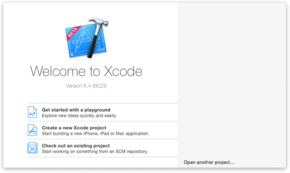
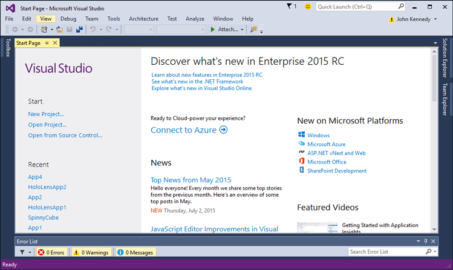
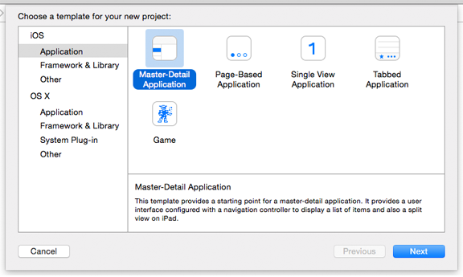
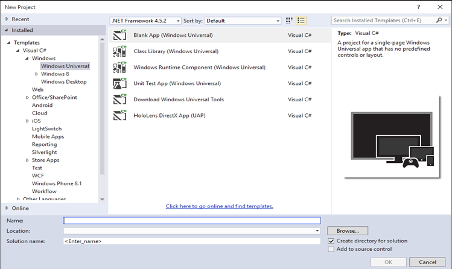

# Getting started: Creating a project

## Creating a project

Microsoft Visual Studio is to Windows as Xcode is to iOS and Mac OS. In this walkthrough, we help you get comfortable using Visual Studio. It shows you the absolute basics you'll need to know to get started. Each time you create an app, you'll follow steps similar to these.

The following video compares Xcode and Visual Studio.

<iframe src="https://hubs-video.ssl.catalog.video.msn.com/embed/5b7bd91f-6a2f-40b6-9b19-eb2994931d0a/IA?csid=ux-en-us&MsnPlayerLeadsWith=html&PlaybackMode=Inline&MsnPlayerDisplayShareBar=false&MsnPlayerDisplayInfoButton=false&iframe=true&QualityOverride=HD" width="720" height="405" allowFullScreen="true" frameBorder="0" scrolling="no">One dev minute - Comparing Xcode to Visual Studio</iframe>

You will also find this [Building apps for Windows blog posting](https://blogs.windows.com/buildingapps/2016/01/27/visual-studio-walkthrough-for-ios-developers/) very helpful.

Creating an app for Windows 10 (more formally referred to as a Universal Windows Platform (UWP) app) is rather like creating an iOS app using Storyboards. The Windows 10 app is often constructed over several pages, each page containing a different part of the user interface, like a web site. Each page usually has two associated source files: one to store the user interface in [XAML overview](https://msdn.microsoft.com/library/windows/apps/mt185595) format, and one that contains the source code, often C#. As your user interacts with your app, they will navigate between these pages. In this walkthrough, you will create an app with two pages.

**Note**  An important feature of Windows 10 apps is the fact that the same source code, and the same API set, is available to you no matter the platform. As you know, when you are writing a universal iOS app for iPhone and iPad, you can determine at run-time which platform your app is running on, and take the appropriate action. In a similar way, Windows 10 apps can tell, at run-time, the device they are running on. With a UWP app, there is no need to use \#ifdef's in your source code to create phone versus desktop builds. Conveniently, Windows 10 apps also intelligently use their user interface controls depending on the device: for example, your app may reference a date picker control, and the control will automatically look and function differently depending on whether it's running on a desktop or a phone screen. Your source code, however, remains the same.

Let's see how we can create a Windows 10 app. Start by running Visual Studio. The first time you run it, Visual Studio will ask you to get a developer license. A developer license lets you install and test UWP apps on your local computer before you submit them to the Microsoft Store. To get a license, follow the on-screen directions to sign in with a Microsoft account. If you don't have one, click the **Sign up** link in the **Developer License** dialog box, and follow the on-screen directions.

For comparison, when you start Xcode, the first thing you see is the **Welcome to Xcode** screen, similar to the following figure.

Visual Studio is very similar. You'll see the **Start Page**, as shown in the following figure.

To create a new app, start by making a project by doing one of the following:

-   In the **Start** area, tap **New Project**.
-   Tap the **File** menu, and then tap **New Project**.

For comparison, when you create a new project in Xcode, you see a list of project templates like those shown in the following figure.

In Visual Studio, there are also several project templates to choose from, as shown in the following figure.

For this walkthrough, tap **Visual C#**, and then tap **Windows**, **Windows Universal** and **Blank App (Windows Universal)**. In the **Name** box, type "MyApp", and then tap **OK**. Visual Studio creates and then displays your first project. Now, you can begin to design your app and add code to it.

## Next step

[Getting started: Choosing a programming language](getting-started-choosing-a-programming-language.md)
