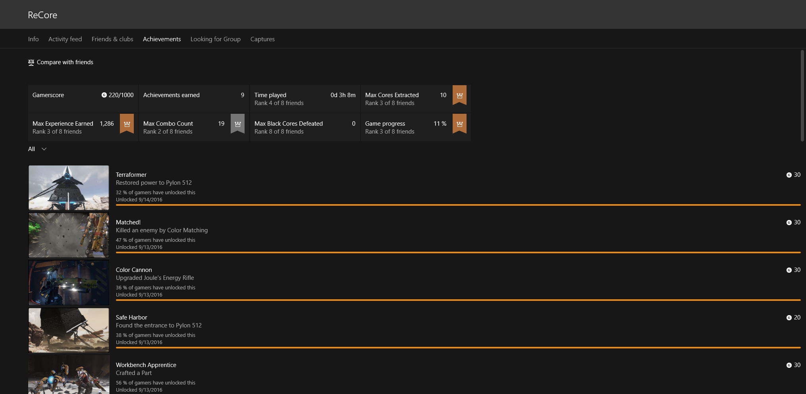

# Player Stats

As described in [Data Platform Overview](../data-platform/data-platform.md), stats are key pieces of information you want to track about a player.  For example *Head Shots* or *Fastest Lap Time*.

These stats can be shown in the [Game Hub](../data-platform/designing-xbox-live-experiences.md), or used to populate leaderboards.  For example, if you have a stat for *Fastest Lap Time*, you could then have a corresponding leaderboard showing lap times for players around the world.

## Defining Stats

For certain types of stats, you will need to configure them on Dev Center.  We will list these out below.

### What needs to be configured

In general stats do not need to be configured, but if your stat is a Featured Stat you will need to define this on Dev Center.  Featured stats will appear on your title's Game Hub.  These will make your Game Hub look more interesting, and generate automatic leaderboards to keep players engaged.  You can also use them to draw attention to certain gameplay mechanics in your title since these are visible to all players on Xbox Live, even if they don't own your title.

Featured stats are automatically given global all-time and monthly leaderboards.  These leaderboards are shown in the GameHub and will show player's progress as compared to their friends.  They can also be shown in your title the same way as regular leaderboards.  For example:

If your stat corresponds to a *Global Leaderboard*, you will also need to define it on Dev Center.  The [Leaderboards](leaderboards.md) article will describe *Global Leaderboards* in more detail.  Briefly, a Global Leaderboard is one where a player is ranked against all other players in the world.

If your stat only corresponds to a *Social Leaderboard*, you do not need to do any configuration on Dev Center.  The [Leaderboards](leaderboards.md) article will describe *Social Leaderboards* in more detail.  Briefly, a Social Leaderboard is one where a player is ranked only against players who they are friends with (someone who is following them, and they are following).

### Configured on Dev Center

The configuration experience depends on version of the Data Platform you are using.

> **Note**
If you are making a title as part of the Xbox Live Creators Program you are using Data Platform 2017.

If you are in the Xbox Live Creators Program or using Data Platform 2017, please see [Configuring Featured Stats or Leaderboards on Dev Center with Data Platform 2017](player-stats-configure-2017.md)

In the case of Data Platform 2013 which is used on XDK and older UWP titles, stats can drive achievements.  If you are a managed partner and need more information, please see [User Stats for Data Platform 2013](https://developer.microsoft.com/en-us/games/xbox/docs/xboxlive/xbox-live-partners/event-driven-data-platform/user-stats).  

## Next Steps

Now that you have some Player Stats and Featured Stats configured.  You are ready to create a leaderboard.  Please see [Leaderboards](leaderboards.md) to get started.
